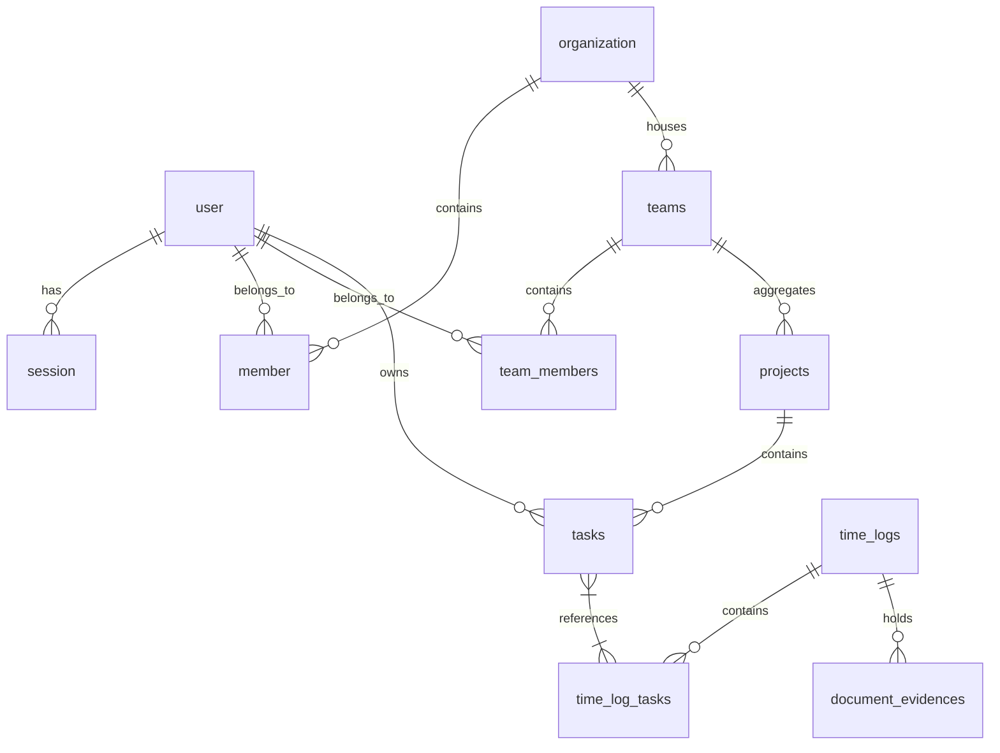

## Technical Stack Overview

Aika's codebase is designed for absolute type safety:

*   **API Protocol**: tRPC v11 with client wrappers for Next.js App Router server and client components.
*   **Authentication Directory**: Better Auth managing database credentials, tenant tables (`organization`, `member`, `invitation`), and session lifecycle tokens.
*   **Database Engine**: Drizzle ORM managing schema definitions, type assertions, and migration queries.

---

## Core Database Tables

The database schemas defined inside `db/schema.ts` dictate the relational model:

### Table Definitions

#### `user`
User profiles, administrative states, and integration OAuth access keys.
*   `id`: Primary Key
*   `is_admin`: Boolean flag granting Global Admin super privileges.
*   `last_active_team_id`: Remembers user workspace context across sessions.
*   `notion_access_token`: Access key to sync and write logs to Notion databases.

#### `teams`
Sub-tenant grouping defined under organizations.
*   `id`: Primary key.
*   `organization_id`: References the parent Organization.

#### `tasks`
Work items tracked by users.
*   `status`: String validation restricted to `'backlog' | 'todo' | 'in_progress' | 'done'`.
*   `priority`: String validation restricted to `'low' | 'medium' | 'high'`.

#### `time_logs`
Chronological timesheet logs.
*   `duration`: Stored in seconds, computed backend-side: $Duration = EndTime - StartTime$.
*   `is_public`: Boolean allowing read-only access to non-authenticated visitors.

---

## Soft Delete Lifecycles

To preserve auditing and historical workload records, Aika enforces soft deletions using a nullable `deleted_at` timestamp.

*   **Tasks**: Soft deleting does *not* delete time logs. The task references in `time_log_tasks` remain intact, and the task name displays as `deleted` in reports.
*   **Projects**: Soft deleting a project sets `project_id` to `null` on all assigned tasks. Time logs are unaffected.
*   **Teams**: Deleting a team sets `deleted_at` on the team row. Team members lose workspace access, but their logged history is preserved inside their Personal Views.
*   **Evidence Files**: Database reference `deleted_at` is set to the delete timestamp. File resources remain preserved in Cloudinary/Supabase storage buckets.
