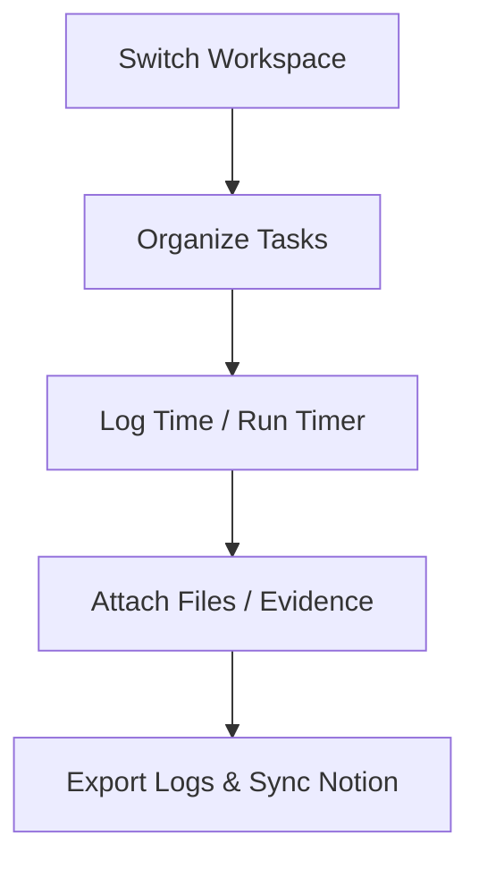

## Welcome to Aika

Aika simplifies time tracking and task coordination. As a member or manager, you'll use Aika to track projects, capture evidence, and analyze team workloads.

### Key Workflow Modules

*   **[Time Tracking](/docs/user/time-logging)**: Log work manually or using the automated live timer.
*   **[Tasks & Projects](/docs/user/projects-tasks)**: Organize work on Kanban boards.
*   **[Evidence Files](/docs/user/attachments-evidence)**: Add file verifications to your logged hours.
*   **[Teams & Invites](/docs/user/collaboration-tenancy)**: Collaborate across organizations and review join requests.
*   **[Reports & Notion Sync](/docs/user/reporting-notion)**: View dashboards, export data, and mirror logs to Notion.
